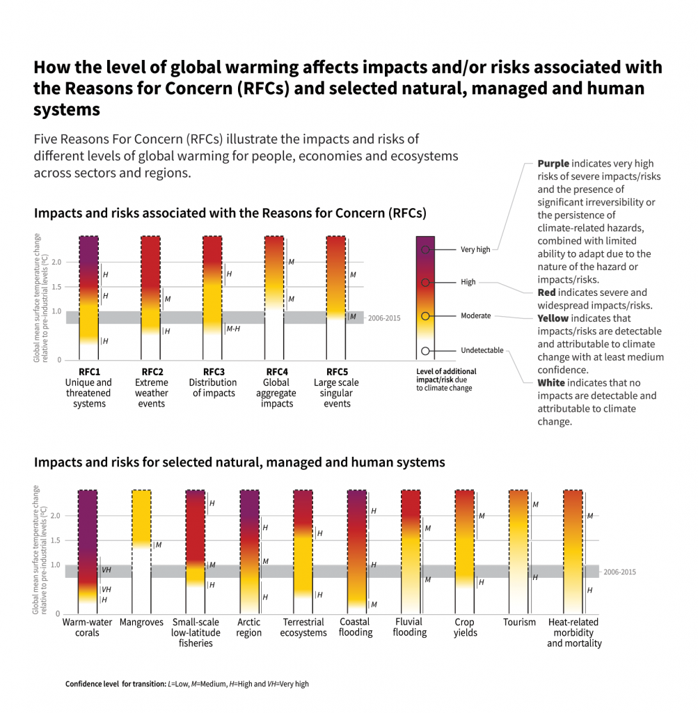

Global Warming refers to the increase in annual temperature with respect to 1850-1900 period. To avert global warming, current ultimate target is to reach [[Net-zero]] as soon as possible.

## Effects
Different systems have different sensitivity to changes in climate. For example, warm water corals would suffer greater impacts for $1 \celsius$ rising temperature while mangroves stay rather indifferent.

# FAQ
1. *Q: Why we set the start at 1850-1900 period?*
	A: Because about that time accurate recordkeeping began.	