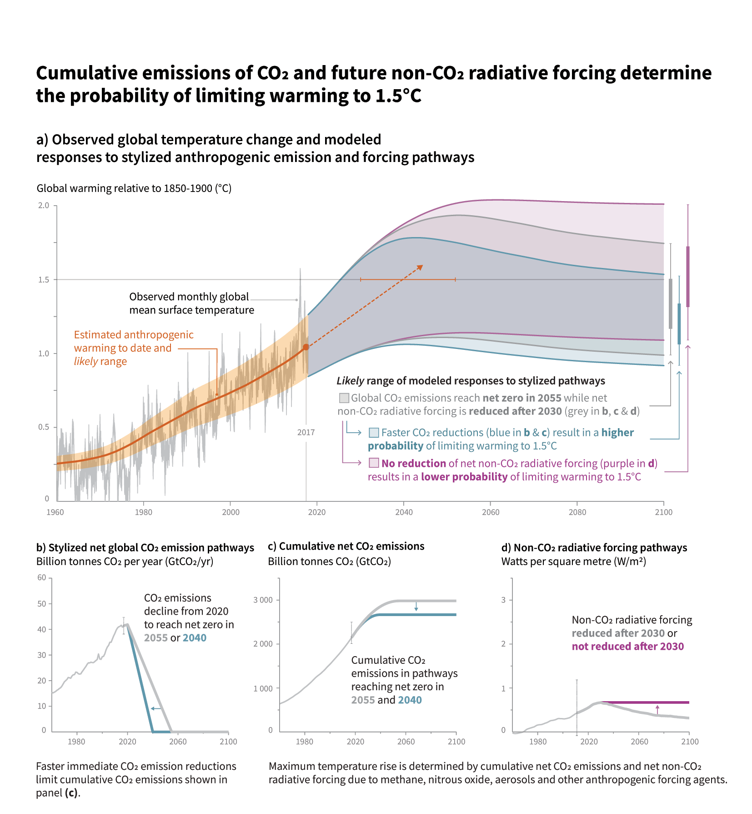

Net-zero \[[[Radiative Forcing]]\] refers to the balance between the incoming energy and outgoing energy on Earth.  Reaching net-zero is essential to avert the effect of [[Global Warming]], or achieve global warming of $1.5 \celsius$ particularly.

The figure below depicts the expected changes in global temperature if we reduce $\mathrm{CO_2}$ and non-$\mathrm{CO_2}$ (e.g. $\mathrm{CH_4}, \mathrm{N_2O}$) radiative forcing. It is safe to say that the faster we get to net-zero, the better chance we can keep the global temperature within $1.5 \celsius$. Along with $\mathrm{CO_2}$ reduction, the reduction of non-$\mathrm{CO_2}$ is important to achieve this goal. 

