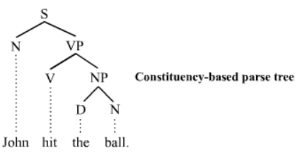
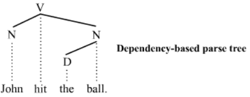

**Goal**: analyse a sentence by identifying its constitutes to model their syntatic relation

**Syntax/parse tree**:
- Node types: root, branch, leaf
	- *Non-terminal*: either root or branch
	- *Terminal*: leaf
- Different types of syntax tree: constitutency-based, dependency-based, etc.

**Context-Free Grammar**: production rules can be applied in any context
- Use syntax tree to represent the constitutes
	
- 

**Dependency Grammar**:
	

---
*Part-of-speech tags* https://www.ling.upenn.edu/courses/Fall_2003/ling001/penn_treebank_pos.html ([examples]( https://stackoverflow.com/questions/15388831/what-are-all-possible-pos-tags-of-nltk))

*Word order*
- English: SVO (subject-verb-object)
- Japanese: SOV

