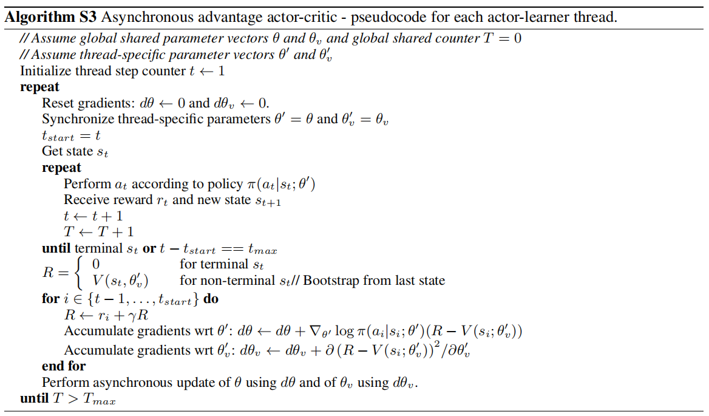

A3C [1] is an asynchronous version of [[Actor-Critic]] method that acts on [[Advantage Function]] (i.e. the difference $Q_\pi(s,a) - V_\pi(s)$ or equivalent unbiased sample $R - V_\pi(s)$).

### Components
To asynchronize [[Actor-Critic]], which simultenously approximates actor $\pi(a \mid s)$ and critic $Q(s,a)$, it is necessary to keep track of local networks and global networks
- Local networks: local actor $\pi_i(a \mid s)$ and local critic $Q_i(s,a)$
- Global networks: global actor $\pi(a \mid s)$ and global critic $Q(s,a)$

### Flow
At each thread,
- Simulate a complete episode with local networks initialized from latest checkpoints of global networks
- Compute and accumulate gradients with respect to local networks
- Use accumulated local gradients to update global networks

***Pseudocode***

### Novelty
- Utilize multiple CPU threads, resulted in reduction almost linearly with respect to the number of spanned agents
- Use multiple different exploratory policies on different threads to break correlation instead of experience replay. Furthermore, it enables on-policy learning.
- Include entropy in actor objective function to "discourage premature convergence to suboptimal determistic policies", or increase exploration
	$$\nabla_{\theta_{\pi_i}} \mathcal{L}(\theta_{\pi_i}) = \nabla_{\theta_{\pi_i}} \log \pi_i(a \mid s)[R - V(s)] + \beta \nabla_{\theta_{\pi_i}} H(\pi_i(a \mid s))$$
	where $H$ is the entropy.

### Experimental settings
Shared [[Convolutional Neural Network (CNN)]] actor-critic with
- Stacked softmax for actor $\pi(a \mid s)$
- Stacked linear for critic $Q_\pi(a,s)$

---
[1] [Asynchronous Methods for Deep Reinforcement Learning](https://arxiv.org/abs/1602.01783)