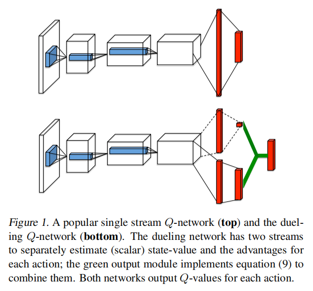

**Original paper**: [Dueling Network Architectures for Deep Reinforcement Learning](https://arxiv.org/abs/1511.06581)

Dueling network uses two estimators: state-value $V(s)$ and advantage function $A(s,a)$, which are later aggregated to create the overall $Q(s,a)$ used to predict actions. The two stream reflects the intuition that apart from the $A(s,a)$, we take into the account when actions make no differences to the overall optimal actions by considering $V(s)$.

To fuse the results, we use the transformed equation that satisfies the identification purpose (i.e. one $Q(s,a)$ corresponds to one $V(s)$ and one $A(s,a)$)
$$Q(s,a)= V(s) + \left[ A(s,a) - \max_{a \in \mathcal{A}} A(s,a) \right]$$

The $\max_{a \in \mathcal{A}}$ can be replaced with $\frac{1}{|A|}$ and stills satisfy the identification.