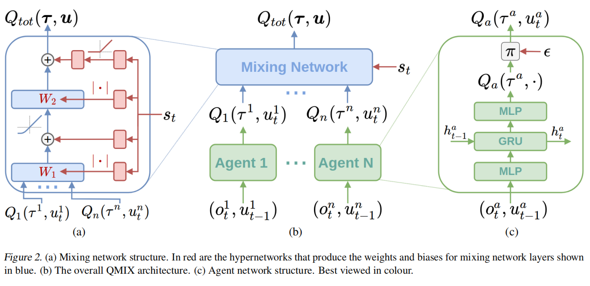

QMIX [1] is a multi-agent reinforcement learning algorithm.

### Components
QMIX contains two different networks:
- $Q_a$ at each agent $a$
- $Q_{tot}$ at centralized coordination

### Flow
- Forward $Q_a$, or **Agent Network**, at each agent on their local dataset (i.e. based on local observation).
- Outputs of $Q_a$ is used by $Q_{tot}$, or **Mixing Network**, combined with additional universal state information to decide local actions that should be taken place at each agent. An auxiliary **Hypernetwork** is used to generate weights used by  $Q_{tot}$.
- $Q_{tot}$ is trained end-to-end using [[Mean Square Error (MSE)]] loss
	$$\mathcal{L}(\theta) = \sum_i (y_i^{tot} - Q_{tot})^2$$

### Novelty
1. To ensure that optimization on $Q_{tot}$ provides beneficial information when locally applied on agent, one needs to ensure that the optimal actions suggested by $Q_{tot}$ (via the $\arg \max$ operation) is the same as by $Q_a$.
	$$\arg \max Q_{tot} = 
	\begin{pmatrix}
	\arg \max Q_1 \\
	\vdots \\ 
	\arg \max Q_n \\
	\end{pmatrix}$$

	Improved upon *Value Decomposition Network*, which formulates $Q_{tot} = \sum_{i} Q_{a_i}$, QMIX proposes generalization with respect to the constraints by enforcing motonocity
	$$\frac{\delta Q_{tot}}{\delta Q_a} \geq 0, \forall a$$

	Intuitively, it ensures the optimization direction (i.e. direction by which we follow will improve the target function) is the same for $Q_{tot}$ and all local $Q_{a_i}$.
	
2. Weights of $Q_{tot}$, i.e. coefficients in linear combination of $Q_a$ outputs, are constrained to be non-negative to enforce the motonocity. On the other hand, it is assumed to be better to transform state information in a non-motonocity. Hence, the authors refuse to include state information directly in $Q_{tot}$ but introduce **hypernetwork** and stack an absolute operation to output non-negative weights.

### Overall architecture

### Settings

- Agent network: uses [[DRQN (Deep Recurrent Q-Network)]] $Q_i(\tau^a, u^a)$
- Mixing network: [[FFN (Feed Forward Network)]] (inputs are $Q_i$)

---

[1] [QMIX: Monotonic Value Function Factorisation for Deep Multi-Agent Reinforcement Learning](https://arxiv.org/abs/1803.11485)