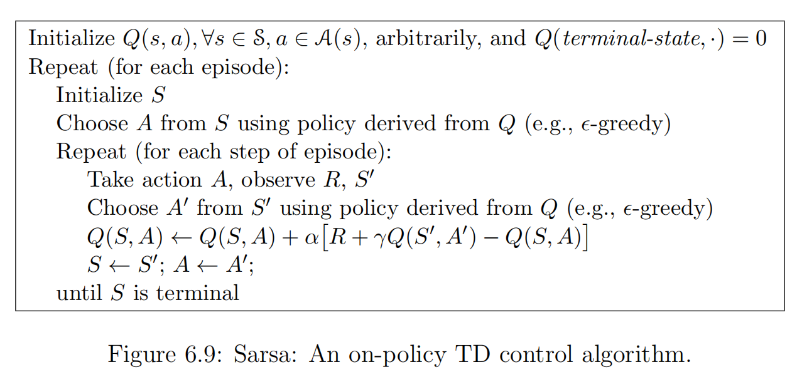

Vanilla algorithm that attempts to directly apply [[Policy Iteration]] with no known [[Markov Decision Process]]. SARSA iteratively runs two consecutive steps:
- Policy Evaluation: use [[Temporal-Difference (TD) Policy Evaluation]] to bootstrap [[Action-value Function, or Q-function]], i.e.
	$$Q_\pi(S_t, A_t) \leftarrow Q_\pi(S_t, A_t) + \alpha(R_{t+1} + \gamma Q_\pi(S_{t+1}, A_{t+1}) - Q_\pi(S_t, A_t))$$
	
	> Observation: The update follows S-A-R-S'-A' order, which gives rise to the algorithm's name. Intuitively, we are doing one-step lookahead.

- Policy Improvement: use [[Epsilon-greedy Policy Improvement]] to greedily take actions among the greediest and exploratory ones.

***Pseudocode***:

**Note**: We can use n-step TD to make the best of [[Temporal-Difference (TD) Policy Evaluation]] and [[Monte-Carlo (MC) Policy Evaluation, or Direct Utility Estimate]], resulted in n-step SARSA.