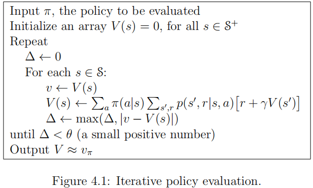

#### Description
Given a policy, we want to predict the [[value function]] given the complete description of the environment, i.e. the [[Markov Decision Process]] behind it.

#### Algorithm

**A. Description**
1. Start with an initial guess $V_0$
2. Iteratively update $V_{k+1}$ such that it satisfies the **Bellman expectation equation** (see [[Bellman equation]]), given the current guess $V_k$ and the rewards $R^{\pi}$

> Application: Policy evaluation is an auxiliary step in [[Policy Iteration]].

**B. Pseudocode**:

