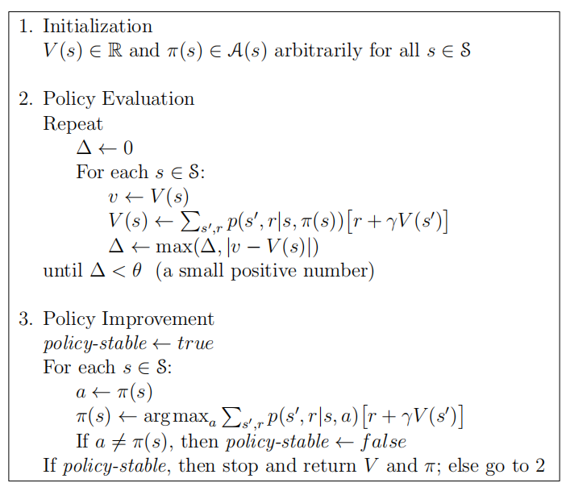

#### Description
Used in [[Planning with given environment description using Dynamic Programming]] to find the optimal [[value function]] and [[policy]].

#### Algorithm

**A. Description**
1. Start with a guess policy $\pi_0$ and value function $V_0$
2. Do [[Policy Evaluation]] to update the value function $V_{k+1}$
3. Do *Greedy Policy Improvement*: update $\pi_{k+1}$ by acting greedily with respect to the value function $V_{k+1}$, which is guaranteed that the policy converges to the optimal policy $\pi_*$ (see [Proof](#proof)).

**Note**: The greedy action update is simultaneously taken at all states.

> The policy iteration is guaranteed to converge to optimal policy if the policy is [[GLIE]].

**B. Pseudocode**

#### Proof
Prove that the new policy $\pi^\prime$ generated by policy improvement actually improves over the current policy $\pi$.

**Hypothesis**: Consider the deterministic policy $\pi$. The greedy approach can be written as
$$\pi^\prime(s) = \arg \max_{a \in \mathcal{A}} Q_{\pi}(s,a)$$
or,
$$Q_{\pi}(s, \pi^\prime(s)) = \max_{a \in \mathcal{A}} Q_{\pi}(s,a)$$
To recall, the deterministic policy also gives $Q_\pi(s, \pi(s)) = V_\pi(s)$ since there is only an action taken.

**Proof**: First, we consider a specific state $s$. It is easy to prove that acting accordingly to $\pi^\prime$ gives better value function than $\pi$ **at that specific state**.
	$$Q_{\pi}(s, \pi^\prime(s)) = \max_{a \in \mathcal{A}} Q_{\pi}(s,a) \geq Q_{\pi}(s,a) = Q_\pi(s, \pi(s)) = V_\pi(s)$$

Next, we need to prove that $V_{\pi^\prime}(s) \geq V_\pi(s)$.
	$$\begin{align}
	V_\pi(s) 
	&\leq Q_\pi(s, \pi^\prime(s)) = \mathbb{E}_{\pi^\prime} \left[ R_{t+1} + \gamma V_\pi(S_{t+1}) \mid S_t = s \right] \\
	&\leq \mathbb{E}_{\pi^\prime} \left[ R_{t+1} + \gamma Q_\pi(S_{t+1}, \pi^\prime(S_{t+1}))  \mid S_t = s \right] \\
	&\leq \mathbb{E}_{\pi^\prime} \left[ R_{t+1} + \gamma [R_{t+2} + \gamma V_\pi(S_{t+2})]  \mid S_t = s \right] \\
	&\leq \mathbb{E}_{\pi^\prime} \left[ R_{t+1} + \gamma R_{t+2} + \gamma^2 Q_\pi(S_{t+2}, \pi^\prime(S_{t+2})) \mid S_t = s \right] \\
	&\leq \mathbb{E}_{\pi^\prime} \left[ R_{t+1} + \gamma R_{t+2} + \gamma^2 R_{t+3} + \dots \mid S_t = s \right] = V_{\pi^\prime}(s) \hfill \tag*{$\square$}
	\end{align}$$

> Upon completion, or $Q_\pi(s,a) = \max_{a \in \mathcal{A}} Q_\pi$, the final policy satisfies the optimality equation
> $$Q_{\pi}(s, \pi^\prime(s)) = \max_{a \in \mathcal{A}} Q_\pi(s,a) = Q_\pi(s,a) = V_\pi(s,a)$$
> or $$V_\pi(s,a) = \max_{a \in \mathcal{A}} Q_\pi(s,a) = V_*(s,a), \forall s \in \mathcal{S}$$

---
### FAQ
Q: How to prove (greedy) policy improvement with stochastic policy?

Q: What are the differences between [[Policy Iteration]] and [[Value Iteration]]?
A: Instead of repeated for 