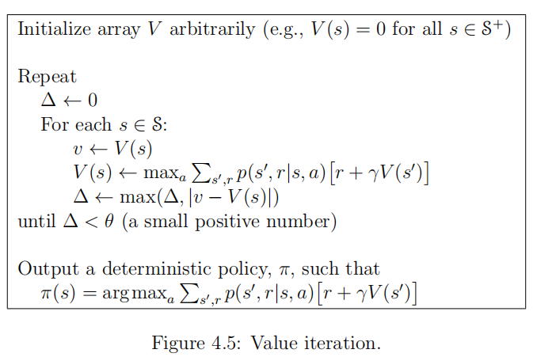

#### Description
Used in [[Planning with given environment description using Dynamic Programming]] to find the optimal [[Value Function]] and [[Policy]].

#### Algorithm
**A. Description**
1. Start with an initial guess $V_0$
2. Iteratively update $V_{k+1}$ such that it satistifies the **Bellman optimality equation** (see [[Bellman Equation]]), given the current guess of optimal policy $V_k$ and the rewards $R^\pi$
3. Given optimal value function $V_\pi$, we act greedily to obtain the optimal policy $\pi_*$

Intuitively, we start from the final reward and work backwards. Yet in implementation, we update all states at once (in fact, we don't know where is our goal or which direction gives best results).

**B. Pseudocode**

---

### FAQ

Q: As we directly iterate over value function, does the final value function correspond to any plausible policy?
A: If we take greedy action on the final, optimal value function, we are guaranteed to get optimal policy. However if we stop midway, i.e. taking an intermediate value function during iteration, it might not achievable by any policy.