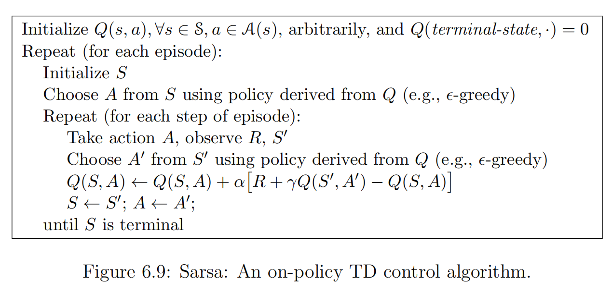

#### Description
Used in [[Planning without environment description, or model-free planning]] to find optimal [[policy]] by iteratively doing [[Temporal-Difference (TD) Policy Evaluation]] in [[Model-Free Policy Iteration]].

#### Algorithms
 
**A. SARSA**

Vanilla algorithm that attempts to directly apply policy iteration:
- Policy Evaluation: directly use [[Temporal-Difference (TD) Policy Evaluation]], i.e.
	$Q_\pi(S_t, A_t) \leftarrow Q_\pi(S_t, A_t) + \alpha(R_{t+1} + \gamma Q_\pi(S_{t+1}, A_{t+1}) - Q_\pi(S_t, A_t))$
	
	> Observation: The update follows S-A-R-S'-A' order, which gives rise to the algorithm's name. Intuitively, we are doing one-step lookahead.
- Policy Improvement: e.g. $\epsilon$-greedy

*Pseudocode*:

**Note**: We can use n-step TD to make the best of [[Temporal-Difference (TD) Policy Evaluation]] and [[Monte-Carlo (MC) Policy Evaluation, or Direct Utility Estimate]], resulted in n-step SARSA.

**B. Q-Learning**

- Almost similar to SARSA, but considering the optimal next action instead of expectation of all actions **defined by the current policy $\pi$**.
	$Q_\pi(S_t, A_t) \leftarrow Q_\pi(S_t, A_t) + \alpha(R_{t+1} + \gamma \max_{a \in \mathcal{A}} Q_\pi(S_{t+1}, a) - Q_\pi(S_t, A_t))$
- Picking the optimal action means that it does not need to follow the current policy $\pi$ and the optimal action may not be followed in the next step.

*Pseudocode*:

**C. Deep Q-Network**

---
### FAQ

Q: Why is SARSA good for on-policy learning while Q-learning good for off-policy?
A: 